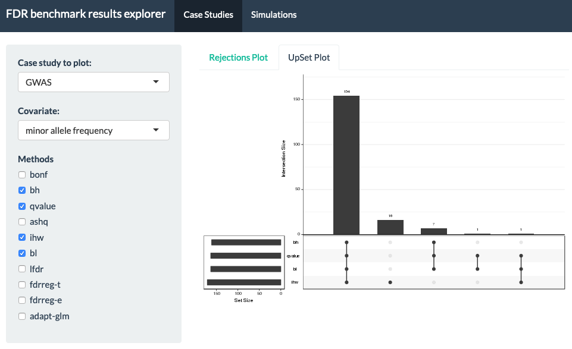
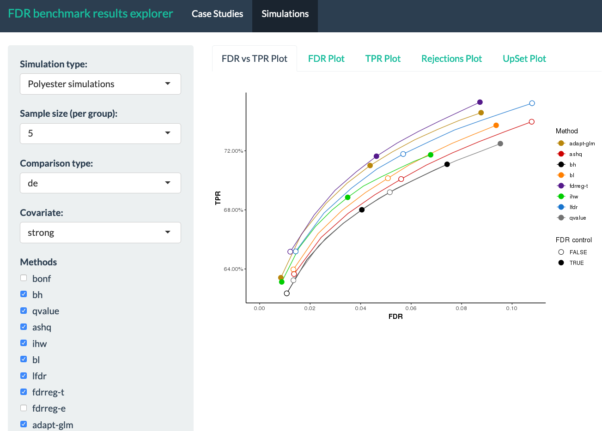

# What is the benchmarkfdr-shiny Application?

This is a Shiny App for exploring results from ["A practical guide to methods controlling false discoveries in computational biology" by Korthauer, Kimes et al. (2019)](https://genomebiology.biomedcentral.com/articles/10.1186/s13059-019-1716-1). In this paper, we generated results from a series of case studies of high-throughput biology, as well as extensive simulation using both resampling techniques and direct simulation of RNA-seq counts using Polyester. This tool enables interactive exploration of these results.

## What kinds of things can I explore?

The tool provides evaluation plots for case studies:

* number of rejections by specified alpha
* overlap among sets using UpSet plots

<br>
<center>

</center>
<br><br>

For the yeast _in silico_ resampling experiments and Polyester simulation studies (over 100 replications):

* mean FDR versus TPR
* FDR by specified alpha
* TPR by specified alpha
* number of rejections by specified alpha
* average overlap among sets using UpSet plots

<br>
<center>

</center>
<br><br>

For each of these plots, you can toggle between different selections of:

* informative covariates 
* datasets 
* simulation settings (e.g. strength of covariate, modality of alternative, sample size, proportion of null hypotheses)
* methods (e.g. subset to compare just Benjamini-Hochberg with IHW)

## How do I run this App?

#### 1. First, make sure you have the following packages installed:

```r
install.packages("BiocManager")
install.packages("devtools")
BiocManager::install(shiny)
BiocManager::install(shinythemes)
BiocManager::install(shinycssloaders)
devtools::install_github("areyesq89/SummarizedBenchmark", ref = "fdrbenchmark") 
BiocManager::install("benchmarkfdrData2019")
```  

Note that newer versions of the `SummarizedBenchmark` package are not compatible, so make sure to use the specific tagged version above. The `benchmarkfdrData2019` Bioconductor package contains the results objects used by the App.

#### 2. Next launch the app:  

```r
shiny::runGitHub("kdkorthauer/benchmarkfdr-shiny")
```
